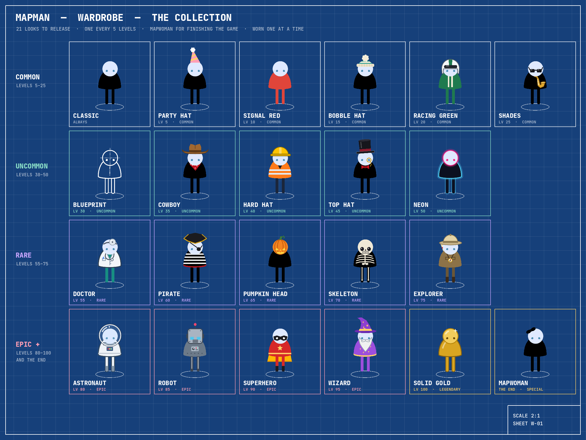
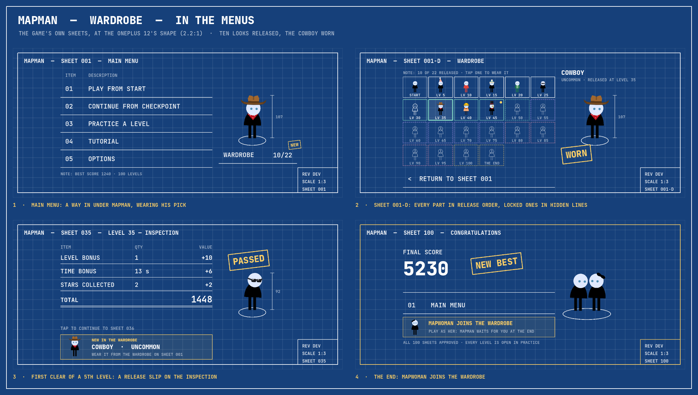
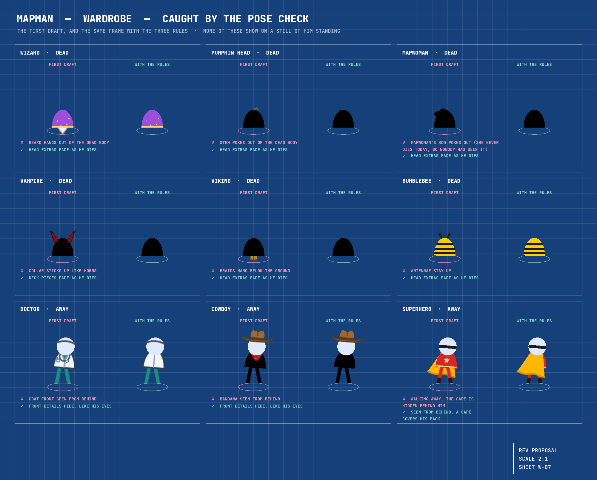

# The wardrobe: looks to collect for MapMan

> **Status: built, October 2026.** This started as the design proposal; it
> now describes what is in the game, and keeps the rules every look must
> follow. Read it before touching looks, releases or how MapMan is drawn. The
> `/new-look` skill is the short version for adding one.

The WARDROBE on the main menu starts as rows of question marks. Each time you
clear a 5th level for the first time, one look is released. The rarer looks
only come late in the game, and finishing the game releases MapWoman. You wear
one look at a time, like a character skin: never a hat plus somebody else's
coat.



- [What you unlock, and when](#what-you-unlock-and-when)
- [How players meet it](#how-players-meet-it)
- [How it is built](#how-it-is-built)
- [Rules for future sessions](#rules-for-future-sessions)
- [Testing](#testing)
- [Decisions, and what is left](#decisions-and-what-is-left)
- [The prototype](#the-prototype)

Contact sheets, all in [`sheets/`](sheets/). The first three come from the
game itself (`godot/tools/wardrobe_sheets.sh`); the last three from the
design prototype.

| Sheet | What it shows |
| --- | --- |
| [01 collection](sheets/01_collection.png) | the 21 looks and Classic, by tier |
| [02 poses 1](sheets/02_poses_1.png), [2](sheets/02_poses_2.png), [3](sheets/02_poses_3.png) | every look in the 11 poses the game puts him in |
| [04 at playing size](sheets/04_at_playing_size.png) | real levels and tiles, at the baselines' 2× |
| [03 bench](sheets/03_bench.png) | 8 alternates, not in the game, same pose check |
| [05 caught by the pose check](sheets/05_caught_by_the_pose_check.png) | 9 bugs in the first draft, and the rules that fixed them |
| [06 in the menus](sheets/06_in_the_menus.png) | main menu, sheet 001-D, the release slip, the end ([singly](sheets/)) |

`godot/tools/wardrobe_sheets.sh --video` also records the parade: every look
walking, turning away, landing, hopping, spinning, stuck, shaking free, dying
and coming back (a 5 MB video, not committed).

## What you unlock, and when

**One look every 5 levels, plus MapWoman for finishing: 21 to collect, 22 with
Classic.** Every 10 would give only ten looks across a hundred levels, and a
new player would wait ten levels for the first. Every 5 brings the first
within a few minutes (a level is a 20-second sheet). From level 70 the
checkpoints are every 5 levels too, so the releases from 70 to 95 all arrive
on checkpoint sheets.

Rarity is how late a look comes and how much there is to it:

| Tier | Levels | What a look in it is | On the sheets |
| --- | --- | --- | --- |
| Common | 5–25 | a colour or a small hat: one part, nothing moving | white |
| Uncommon | 30–50 | a bigger hat with a matching piece, or a special finish | mint |
| Rare | 55–75 | a whole outfit: head, body and legs | lilac |
| Epic | 80–95 | outfits that move or change shape: a cape, sparkles, a glass helmet, a box head | pink |
| Legendary | 100 | Solid Gold | gold |
| Special | the end | MapWoman | gold |

| Level | Look | Tier | What he wears | Why there |
| --- | --- | --- | --- | --- |
| start | Classic | | MapMan as he is | worn until you pick something |
| 5 | Party hat | Common | striped cone, pom-pom | first release, minutes in: a party for finding the wardrobe |
| 10 | Signal red | Common | red body and legs | first checkpoint |
| 15 | Bobble hat | Common | knitted hat, cuff, pom-pom | |
| 20 | Racing green | Common | green with two white stripes | checkpoint |
| 25 | Shades | Common | sunglasses | just after the first wall of death tiles (24–26) |
| 30 | Blueprint | Uncommon | white linework with centre lines: he becomes the drawing | checkpoint |
| 35 | Cowboy | Uncommon | hat and red bandana | level 35 has one of the tightest clocks |
| 40 | Hard hat | Uncommon | hard hat and hi-vis vest, the site engineer | checkpoint |
| 45 | Top hat | Uncommon | top hat, red bow tie, monocle | |
| 50 | Neon | Uncommon | dark body in a glowing cyan and pink outline | halfway, checkpoint |
| 55 | Doctor | Rare | white coat, stethoscope, head mirror | |
| 60 | Pirate | Rare | tricorn, eye patch, striped shirt | checkpoint |
| 65 | Pumpkin head | Rare | jack-o'-lantern head with a glowing carved face | Halloween; after level 62's tight clock |
| 70 | Skeleton | Rare | skull, ribs and leg bones | Halloween; checkpoint |
| 75 | Explorer | Rare | pith helmet, compass, a rolled map on his back | his day job; after level 72's tight clock; checkpoint |
| 80 | Astronaut | Epic | glass helmet, white suit, chest panel | checkpoint |
| 85 | Robot | Epic | box head, LED eyes, antenna | checkpoint |
| 90 | Superhero | Epic | mask, a gold cape that flies out behind | checkpoint |
| 95 | Wizard | Epic | bent hat, long beard, starry robe, sparkles as he walks | checkpoint |
| 100 | Solid gold | Legendary | gold all over, with a twinkle | the last sheet |
| the end | MapWoman | Special | play as her: MapMan waits for you at the end | finishing the game |

"Tight clock" is from `python3 godot/tools/level_report.py`: levels 35, 62 and
72 have negative slack on the safe route, so they need time tiles.

**MapWoman** is the figure the game already draws at the end (`art =
"woman"`, MapMan with a bow). What makes her special is the ending: wearing
her, the roles turn round. MapMan waits on the bonus map and she walks to
him, which is a reason to play the game through again.

**The bench** ([sheet 03](sheets/03_bench.png)) has eight more, drawn and
pose-checked in the prototype but not in the game: Chef, Viking, Ninja,
Vampire, King, Propeller cap, Bumblebee and Graduate. They could swap into
the list, or come as a second wave released by feats rather than levels:
Graduate for finishing the tutorial, Bumblebee for 100 stars in all, Ninja
for ten levels in a row without losing a life, King for finishing with all
three lives. Feats need counters the save doesn't keep yet (stars in all,
streaks). Ninja's body (`#1b1b22`) is 1.67:1 on the paper and would need an
outline or a darker colour to pass rule 12.

**The schedule is fixed**, not shuffled. Each question mark says exactly when
it is released ("LV 35"), which gives the player a goal; we chose the first
look (a hat, not a colour); everyone has the same game to talk about, and
tests stay simple. The surprise survives: nobody knows what is behind LV 35
until they clear it. If chance is ever wanted, keep the tiers fixed and
shuffle the order *within* a tier per save, storing the shuffled ids in the
save so adding looks later never changes what a player already has.

**Players who already have progress** get everything they have earned the
first time the game loads their save, marked NEW (see [the save](#the-save)).

## How players meet it



1. **Main menu (sheet 001).** A WARDROBE row under MapMan shows how many
   looks are in it ("1/22" on a fresh save: Classic counts), with a gold NEW
   tag while a released look hasn't been looked at. MapMan wears the chosen
   look on every sheet, and the dimension line beside him measures him with
   his hat on (107 in the cowboy hat instead of 92). Why not a sixth row in
   the parts list: the five rows of 44 already run from y 80 to 300 on a
   sheet 375 high, and a sixth would push the note into the frame.
2. **Sheet 001-D, WARDROBE.** All 22 looks in release order, six to a row,
   each cell framed in its tier colour. Locked looks are drawn in dashed
   *hidden lines* (the drafting convention for parts you can't see) with a
   question mark and the level that releases them; their cells are disabled
   buttons, and a screen reader says "Locked, released at level 55". Tap a
   released look and MapMan on the right puts it on at once and it is saved:
   the WORN stamp slams again and he hops. Over him, the look's name, its
   tier and when it was released. Keyboard and gamepad focus starts on the
   worn look.
3. **The release.** The first time a 5th level is cleared in the main game,
   its inspection or checkpoint sheet gets a gold *release slip* along the
   bottom: the new look in miniature, its name and tier, and a WEAR IT
   button that puts it on him there and then (the sheet redraws with him in
   it, and the button turns to WORN). The look is saved the moment the slip
   shows, even if the player quits on that sheet. The sheet's WARDROBE
   button opens the wardrobe, whose last row then goes back to it. The
   PASSED and APPROVED stamps rise clear of a tall hat.
4. **The end.** Finishing the game puts MapWoman in the wardrobe, and the
   congratulations sheet says so: MAPWOMAN JOINS THE WARDROBE, play as her.

**Words and languages.** 47 new strings (22 names, 6 tiers, the sheet, the
slips and the screen-reader names), each in all 14 translations; the Arabic
and CJK font subsets were re-cut from the same Noto versions as before, so
only glyphs were added. Names are at most 14 Latin characters and plain.
Spanish says VESTUARIO rather than ARMARIO ("in the wardrobe from the start"
must not read as "in the closet"), and Portuguese GUARDA-ROUPA, 12 letters,
sets the main-menu row's width.

## How it is built

### Looks are drawn in code, in `Player._draw()`

MapMan has no sprite: `player.gd` draws a bell body, a round head, two stick
legs and two eyes. Looks are drawn in the same `_draw()`, so every dial the
game turns (walk, look, lean, squash, hop, spin, mirror, cobweb, death) moves
their parts for free: they are drawn in the same transform from the same
anchors. They stay sharp at every size (1.2× on the menus, about 3.8× on the
phone) with no import pipeline. MapWoman's bow was already exactly this, the
first part.

Sprites or child nodes on the player would each need their own copy of the
lean, squash, flip and death maths, their own z-order and visibility, and
tweens to kill on reset. Each of those is a bug waiting to happen.

### Layers

`Player._paint()` draws back to front: **back** (cape, map roll), **legs**,
**body**, **neck**, **head**, **eyes**, **face**, **hat**, **front**
(sparkles), then the cobweb as before. `Outfits.draw(pen, layer, id)` adds
the look's parts to each layer.

- **Seen from behind** (`pen.from_behind()`, the rule the eyes already
  follow), back parts draw over the body (the cape covers his back) and
  front-only details check `pen.front()` and stay out.
- **Dying**, the body and neck draw over the head, eyes and face (he is
  swallowed whole, as before); what sticks out of the head fades in the
  first half of the death, neck pieces fade with it, and the hat flies off:
  up, backwards, turning and fading. All of it is worked out from `dead`, so
  there is no new state and nothing new to reset. With reduce motion `dead`
  jumps to 1 and the hat is simply gone.

**Classic didn't change.** With no look, the layered `_draw()` makes exactly
the draw calls it made before: every existing screenshot baseline still
matches, and `Player.standing_height("classic")` is 77, the menus' old
constant.

### Files

| File | What it does |
| --- | --- |
| `scripts/player.gd` | `outfit` beside `art`; `_paint()` draws the layers through the pen; `measure()` gives his box without drawing; `standing_height(id)` for the dimension line. |
| `scripts/outfits/outfit_pen.gd` | `OutfitPen`: the pose of this frame (head centre and radius, hips, feet, bob, squash, drop) and the drawing calls parts use: `b()` for a body point at rest, `h()` relative to the head, `hat_*` for hats, `band()`, `stripe()`, `eye()`; and a measure mode that grows a box instead of drawing. |
| `scripts/outfits/outfits.gd` | `Outfits`: each look's colours by role (`PALETTES`), which looks have something on the back (`BACKS`), and the dispatch of each layer to the part files. |
| `scripts/outfits/outfit_hats.gd`, `outfit_faces.gd`, `outfit_bodies.gd`, `outfit_backs.gd` | the parts, as static functions on the pen, by layer. |
| `scripts/wardrobe.gd` | `Wardrobe`: the 22 looks (id, name msgid, release level, tier), `released_at(level)`, `earned(furthest_level, has_completed)`. |
| `scripts/save.gd` | the `[wardrobe]` section, below. |
| `scripts/wardrobe_sheet.gd` | `WardrobeSheet`: the WARDROBE row on 001, sheet 001-D, the release slips, and their `TEXT`. `menus.gd` delegates to it (it was already near gdlint's 1,300-line limit) and dresses its figures in `Save.worn`. |
| `scripts/main.gd` | the release in `advance_level()`, MapWoman's in `finish_advancing_level()`, the worn look on a new game, the ending's partner, the `wardrobe` and `wear <id>` actions, Android back. |
| `scripts/dev_panel.gd` | dev-build cheats: release every look, empty the wardrobe. |
| `tools/wardrobe_sheets.sh`, `wardrobe_sheets.gd`, `wardrobe_parade.gd` | sheets 01, 02 and 04 from the real game, and the parade video. |
| `i18n/catalog.json`, `i18n/*.json`, `assets/fonts/i18n/` | the strings, the translations, the re-cut fonts. |

### The save

```ini
[wardrobe]
worn="cowboy"
released=["party_hat", "signal_red", "bobble_hat"]
seen=["party_hat", "signal_red"]
```

The change is additive (old saves load as they are), so it shipped as
`feat:`, not `feat!:`. On load, `Save.sync_wardrobe()` releases every look the
progress has earned: a level's once `furthest_level` is past it, and all of
them once `has_completed` (the last level leads to the ending, not to a level
101, so `furthest_level` never passes 100). That gives existing players
theirs, and covers levels skipped with the dev cheat. Unknown ids and
repeats are dropped; a worn id that isn't released falls back to Classic.
The released ids are stored rather than derived each time, so the slip can
save its look the moment it shows, and feats can be added later.

### The release moment

In `main.gd` `advance_level()`, after practice has returned and the tutorial
has moved on: `Wardrobe.released_at(level)` names the look, `Save.release()`
says whether it is new, and `show_end_level()` gets the id for the slip (or
""). Playing again from the start or a checkpoint releases nothing new.
MapWoman is released in `finish_advancing_level()`, where `has_completed`
is set, and the congratulations sheet shows her slip only when she is new.

### MapWoman as a look

`_start_ending()` picks the partner: wearing MapWoman, the figure waiting on
the bonus map is Classic MapMan; otherwise MapWoman. The menus' pair on the
end sheets swaps the same way.

## Rules for future sessions

These keep extra parts on the character from turning into bugs. Rules 7
and 8 came from the first pose check, which found 9 bugs in the first draft
([sheet 05](sheets/05_caught_by_the_pose_check.png)). None of them shows on
a still of him standing. `tests/unit/test_outfits.gd` checks what can be
checked.



1. **Keep the figure.** The bell body, round head, two stick legs and eyes are
   MapMan in every look. Looks add to him or recolour him. Only an Epic look
   may change a shape (Robot's head), and then rule 9 applies.
2. **One look, one string.** `Player.outfit` holds one id, so a cowboy hat and
   a doctor's coat cannot combine, by construction.
3. **Everything through the pen, nothing new to remember.** No child nodes,
   sprites or tweens for parts, and no `draw_*` calls of their own. A part's
   state comes from the pose the pen carries (`walking`, `phase`, `look`,
   `squash`, `dead`, `happy`, `idle_clock`). Then `reset_pose()` resets the
   parts as well, and screenshots stay deterministic: no `randf()` and no
   clock reads in a part.
4. **Anchor to the pose, never to the screen.** Body parts use rest
   coordinates through `pen.b()` (bob, squash and the drop when dying are
   applied there). Head parts use `pen.h()`, which sinks and shrinks with the
   head. Hats use `pen.hat_*`, which ride the head and fly off it. Face parts
   use `pen.eye()`. Leg parts follow each leg's curve through hip, knee and
   foot with `pen.leg()` and `pen.leg_line()`, since the legs bend.
5. **Four views.** Front. Side, which is the figure mirrored with the face
   shifted by `look.x` (front details shift with it). From behind: no face,
   no front-only details, back parts over the body. Dying. Mirroring flips
   everything, so an eye patch changes eye with the facing, which is fine
   for drawn parts but not for writing (rule 6).
6. **No writing or logos on him.** Mirroring would reverse it, translators
   can't reach it, and logos invite trouble. The same goes for the red cross
   emblem, which is protected by the Geneva Conventions (the doctor has a head
   mirror and a stethoscope instead), real uniforms, and national or
   religious dress.
7. **Seen from behind, front details hide like the eyes do, and a cape covers
   his back.**
8. **The death rules.** Hats fly off. Anything that sticks out of the head
   (a beard, a stem, antennae, MapWoman's bow) fades in the first half of the
   death. Neck pieces fade as the body takes the head. Nothing may poke out of
   the dead body. Player applies all of this to the layers; a part only has
   to be in the right layer.
9. **A changed shape must still fit.** A head that isn't a circle (Robot) must
   shrink inside the dead body. Check the DEAD column.
10. **Eyes carry the expression.** Looks that replace the eyes (pumpkin,
    skull, robot) must still blink, look about and widen when he is happy
    (`pen.eye_open()`). Shades are the one look that hides them, on purpose.
11. **Size budget.** Up to 110 units above the tile centre and 42 to either
    side. Classic reaches 83 up and 26 to a side, so this is about one tile
    row higher and one column wider. A flying hat may rise past 110 for a
    moment while he dies; the test allows that pose. Measured across five
    poses:

    | Tallest | Units up | Widest | Units to a side |
    | --- | --- | --- | --- |
    | Party hat | 109 | Cowboy (brim) | 41 |
    | Wizard | 105 | Pirate | 37 |
    | Top hat | 104 | Explorer | 35 |
    | *Classic* | *83* | *Classic* | *26* |

12. **Readable on blue paper and on white tiles.** Classic gets this from a
    dark body (2.05:1 on the paper, 14.7:1 on a tile) and a light head. A look
    needs its body at 1.8:1 or more against the paper and its legs at 2.5:1 or
    more against a tile, or an outline or glow that passes the same ratio.
    The first wizard robe was 1.16:1, nearly invisible on the paper, and the
    first superhero red 1.65:1; both were lightened. Paper `#16407a`; a tile
    is white at 80% over it, `#d0d9e4`.

    | Look | Body on paper | Legs on a tile | Outline |
    | --- | --- | --- | --- |
    | Classic | 2.05 | 14.73 | |
    | Signal red | 2.48 | 2.90 | |
    | Racing green | 1.93 | 3.72 | |
    | Blueprint | 1.00 | 7.19 | white, 10.25 on paper |
    | Hard hat | 3.93 | 10.62 | |
    | Neon | 1.85 | 13.28 | cyan, 5.33 on paper |
    | Doctor | 9.37 | 2.79 | 7.70 on a tile |
    | Explorer | 2.25 | 4.89 | |
    | Astronaut | 9.12 | 1.27 | 6.51 on a tile (legs too) |
    | Robot | 2.33 | 6.71 | |
    | Superhero | 2.05 | 3.51 | |
    | Wizard (first draft) | **1.16** | 8.32 | |
    | Wizard | 2.23 | 3.22 | |
    | Solid gold | 4.57 | 1.57 | 3.73 on a tile (legs too) |

13. **Decorative motion respects reduce motion.** Cape ripple, sparkles and
    twinkles check `pen.motion` (`Blueprint.motion()`). Walking and dying
    don't, because they are the game.
14. **Cheap to draw.** Plain polygons and lines; no shaders or textures. If a
    look gets busy, measure it on the phone with the dev build.
15. **Change looks only on sheet 001-D**, never during a level.
16. **Look at the pose check before calling a look done**
    (`tools/wardrobe_sheets.sh`). The bugs above don't show on a still of
    him standing.
17. **Pin the wardrobe in the screenshot tools and in tests that check a
    sheet's layout or picture.** MapMan wears `Save.worn` on every sheet and
    the main menu shows the count, and the autoload reads the machine's real
    save even with `persist` off: set `worn`, `released` and `seen` first.

## Testing

- **Classic is proven by what didn't change:** the layered `_draw()` left
  every existing screenshot baseline as it was.
- `tests/unit/test_outfits.gd`: every look in every pose draws (headless,
  `_draw()` runs there); the size budget; Classic's height and that hats add
  to it; the contrast rule for every palette; a hat is lower at `dead` 0.98
  than standing; every palette and back id is a look; the wizard's sparkles
  need decorative motion.
- `tests/unit/test_wardrobe.gd`: the list (one look per 5th level, tiers in
  order, unique ids), what progress earns, old saves syncing, bad entries
  dropped, only released looks worn; in play, the first clear of a 5th level
  releases once, other levels, practice, the tutorial and replays release
  nothing, finishing releases MapWoman, a new game wears the worn look, and
  the `wear` and `wardrobe` actions.
- `tests/unit/test_ending.gd`: wearing MapWoman, MapMan waits.
- `tests/unit/test_menus.gd`, `test_back_button.gd`: the sheet's buttons
  report `wear <id>`, locked cells are disabled, the main menu reports
  `wardrobe`, heroes wear the worn look, the pair swaps, back leaves the
  wardrobe for the main menu.
- `tests/unit/test_i18n.gd`: the strings are in the catalog and every
  translation; sheet 001-D and the slips lay out in every language.
- Screenshot baselines: `25_wardrobe` (new), `08_level_clear` (the slip for
  Signal red at level 10), `01_main_menu` and `21_main_menu_ar` (the row).
  `09_tutorial`, `11_ending` and `12_ending_meeting` moved by a few random
  tile outlines: the slip's small MapMan takes one random number when it is
  made.
- Visual review: sheets 01, 02 and 04 and the parade from
  `tools/wardrobe_sheets.sh`; `tools/i18n_shots.sh` includes the wardrobe
  screens in every language.
- **On the phone:** readability while moving in each look, the release
  moment, the tilt-look on sheet 001-D.

## Decisions, and what is left

Decided in building it: a fixed schedule; a release does not put the look
on, the wardrobe does; the way in is a WARDROBE row under MapMan; the list as
proposed; MapWoman is exactly the ending's MapWoman; practice clears don't
count.

Left for later, if wanted: the bench and feats (needs save counters),
shuffling within tiers, seasonal looks. (MapMan used to lean when walking;
he no longer does, and his walks are the original sprite's frame for frame.)

## The prototype

[`prototype/`](prototype/) is the design prototype the looks were drawn in,
**not game code**: a `Player` subclass with the layered `_draw()` and all 30
looks (`outfit_figure.gd`), the proposed list (`catalogue.gd`), and scripts
for sheets 03, 05 and 06 and the first menu mockups. It lives outside
`godot/`, so the game, lint and CI never load it. Sheets 01, 02 and 04 and
the parade now come from `godot/tools/wardrobe_sheets.sh` instead; the
prototype is kept for the bench looks and the mockups.

```sh
godot --headless --path godot --import    # once: the class names must be known
docs/wardrobe/prototype/render.sh          # sheets 01–06 from the prototype
docs/wardrobe/prototype/render.sh --video  # and its parade.mp4
```

What it established, before the build: the layered `_draw()` draws Classic
exactly as before (0 of 486,200 pixels differ across 11 poses); `_draw()`
runs in headless test runs; the size and contrast tables above; and the 9
bugs on sheet 05, all fixed by rules 7 and 8.
